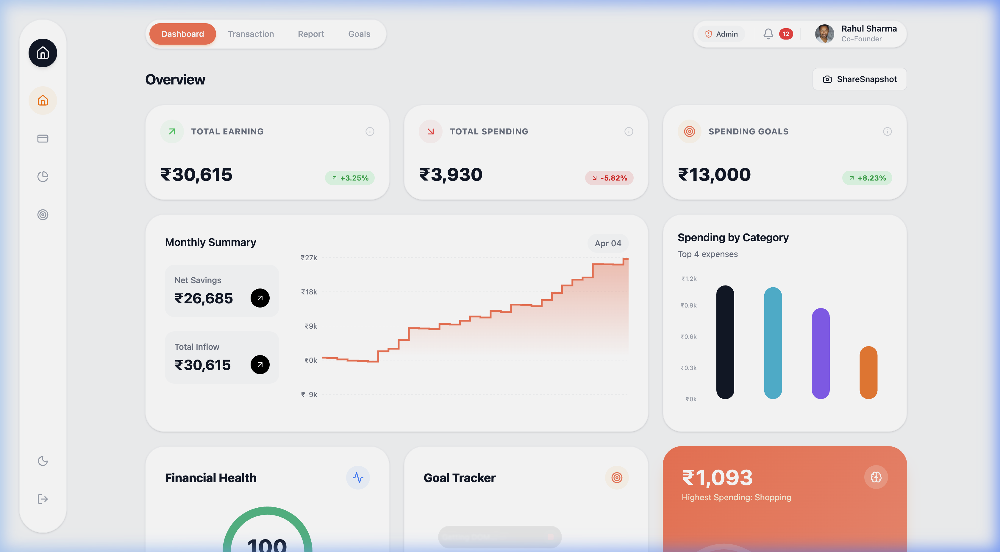
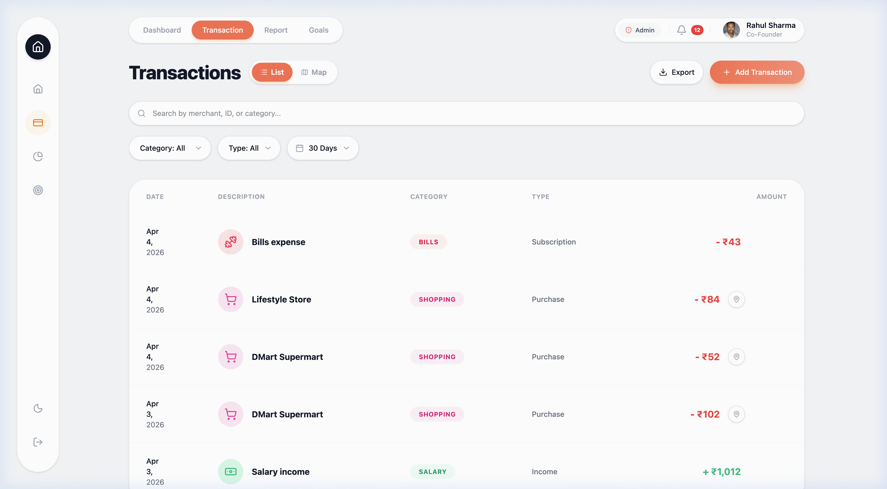
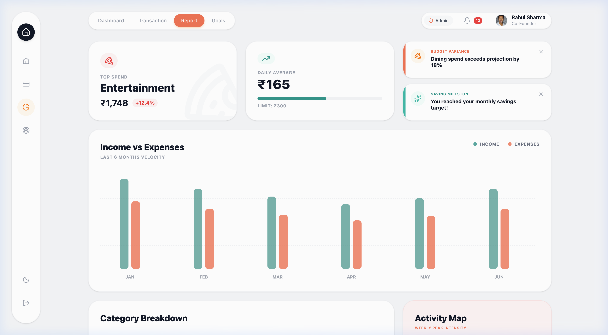

# FinDash — Finance Dashboard UI

A modern, interactive finance dashboard built with React, TypeScript, and Tailwind CSS. Track spending, analyze patterns, and visualize transactions across an interactive map — all with a clean, responsive interface.



## 🚀 Quick Start

```bash
# Clone the repository
git clone https://github.com/vivekpal2001/finance-dashboard-ui.git
cd finance-dashboard-ui

# Install dependencies
npm install

# Start the development server
npm run dev
```

The app will be running at **http://localhost:3000**

## 🛠️ Tech Stack

| Technology | Purpose |
|-----------|---------|
| **React 19** | UI framework |
| **TypeScript** | Type safety |
| **Vite** | Build tool & dev server |
| **Tailwind CSS v4** | Styling |
| **Redux Toolkit** | State management (transactions, UI, goals) |
| **Framer Motion** | Animations & transitions |
| **Recharts** | Charts & data visualization |
| **Leaflet + OpenStreetMap** | Interactive transaction map |
| **Lucide React** | Icons |
| **date-fns** | Date utilities |

## 📋 Features & Requirements Mapping

### 1. Dashboard Overview
- **Summary cards** — Total Earning, Total Spending, and Spending Goals with animated counters and trend indicators
- **Time-based visualization** — Monthly balance trend (area chart) showing income vs expense flow over time
- **Categorical visualization** — Spending by Category (bar chart) breaking down expenses by type
- **Financial Health Score** — Animated SVG gauge showing overall financial health (0–100)
- **Goal Tracker** — Visual progress toward savings goals
- **AI Insights** — Smart highlights of spending patterns


### 2. Transactions Section
- Full transaction list with **date, amount, category, type, and merchant name**
- **Search** — Filter by merchant name, category, or ID
- **Filters** — Category dropdown, Income/Expense type, Date range (7/30/90 days or All Time)
- **Sorting** — By date or amount (ascending/descending)
- **Desktop** — Full data table with hover actions
- **Mobile** — Card-based layout optimized for touch
- **Map View** — Toggle between List and Map to see transactions plotted on an interactive map of India with custom pin icons
- **Locate on Map** — Click the 📍 button on any GPS-tagged transaction to fly to its location on the map
- **Export** — Download filtered transactions as CSV or JSON



### 3. Role-Based UI
- **Toggle** between Admin and Viewer roles via the header button
- **Admin** — Can add, edit, and delete transactions
- **Viewer** — Read-only access; add/edit/delete buttons are hidden
- Role state managed through Redux and persists during the session

### 4. Insights Section
- **Top Spending Category** — Identifies the highest expense area with amount
- **Daily Average Spend** — Calculates average daily expenditure with budget progress bar
- **Income vs Expenses** — 6-month bar chart comparison
- **Category Breakdown** — Detailed progress bars per category with percentages
- **Activity Heatmap** — Weekly spending intensity map
- **Smart Alerts** — Warns about unusual spending patterns



### 5. State Management
- **Redux Toolkit** with three slices:
  - `transactionsSlice` — Transaction CRUD, search, filters, sort
  - `uiSlice` — Theme (dark/light), role (admin/viewer), sidebar state
  - `goalsSlice` — Savings goals management
- **localStorage persistence** — Transactions and goals survive page refreshes
- **Typed hooks** — `useAppDispatch` and `useAppSelector` for type-safe Redux access

### 6. UI/UX Quality
- **Fully responsive** — Desktop sidebar, tablet layout, mobile bottom navigation bar
- **Dark/Light mode** — Toggle via header button, respects system preference pattern
- **Smooth animations** — Page transitions, card animations, staggered list rendering via Framer Motion
- **Empty states** — Graceful handling when no data matches filters
- **iOS safe-area** — Proper viewport handling for notched devices

## ✨ Optional Enhancements (All Implemented)

| Enhancement | Implementation |
|------------|---------------|
| ✅ Dark mode | Full dark theme toggle with Tailwind `dark:` classes |
| ✅ Data persistence | localStorage for transactions and goals |
| ✅ Animations | Framer Motion page transitions, card animations, animated counters |
| ✅ Export functionality | CSV and JSON download of filtered transactions |
| ✅ Advanced filtering | Combined category + type + date range + search filters |

## 🗂️ Project Structure

```
src/
├── components/
│   ├── Layout.tsx                    # Main layout with sidebar & bottom nav
│   ├── dashboard/
│   │   ├── SummaryCards.tsx          # Earning/Spending/Goals cards
│   │   ├── BalanceChart.tsx          # Monthly trend area chart
│   │   ├── CategoryChart.tsx        # Spending breakdown bar chart
│   │   ├── HealthScore.tsx          # Financial health gauge
│   │   ├── GoalTracker.tsx          # Savings goal progress
│   │   ├── AIInsights.tsx           # Smart spending insights
│   │   ├── RecentTransactions.tsx   # Quick transaction list
│   │   └── AlertCard.tsx            # Alert notifications
│   └── transactions/
│       ├── TransactionModal.tsx      # Add/Edit transaction form
│       └── TransactionMapView.tsx   # Interactive Leaflet map
├── pages/
│   ├── Dashboard.tsx                # Main overview page
│   ├── Transactions.tsx             # Transaction list + map view
│   ├── Insights.tsx                 # Analytics & spending patterns
│   ├── Goals.tsx                    # Savings goals management
│   └── Timeline.tsx                 # Financial timeline playback
├── store/
│   ├── index.ts                     # Redux store configuration
│   ├── hooks.ts                     # Typed dispatch & selector hooks
│   └── slices/
│       ├── transactionsSlice.ts     # Transaction state & actions
│       ├── uiSlice.ts               # Theme, role, sidebar state
│       └── goalsSlice.ts            # Goals state & actions
├── types/
│   └── index.ts                     # TypeScript interfaces
├── lib/
│   └── utils.ts                     # Currency formatting, classnames
├── index.css                        # Global styles & Leaflet overrides
├── main.tsx                         # App entry point
└── App.tsx                          # Router configuration
```

## 🎨 Design Approach

- **Card-based layout** with generous `rounded-[32px]` corners for a modern feel
- **Floating sidebar** on desktop, **bottom navigation bar** on mobile (native app pattern)
- **Animated navigation** — Active tab indicators slide with spring physics
- **Color system** — `#FF6B4A` (orange) as primary accent, emerald for income, semantic colors for categories
- **Typography** — System font stack with bold weights for financial data emphasis
- **Custom map pins** — SVG-based markers with ₹ symbols, orange for expenses, green for income

## 📱 Responsive Breakpoints

| Viewport | Layout |
|----------|--------|
| < 640px (mobile) | Bottom nav, card-based transactions, stacked layouts |
| 640–1024px (tablet) | 2-column grids, compact spacing |
| > 1024px (desktop) | Fixed sidebar, full data tables, 3-column grids |

## 📄 License

MIT
